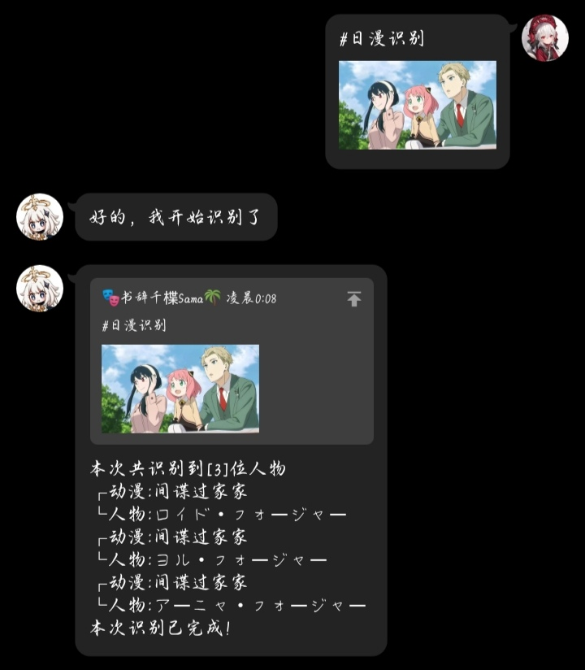
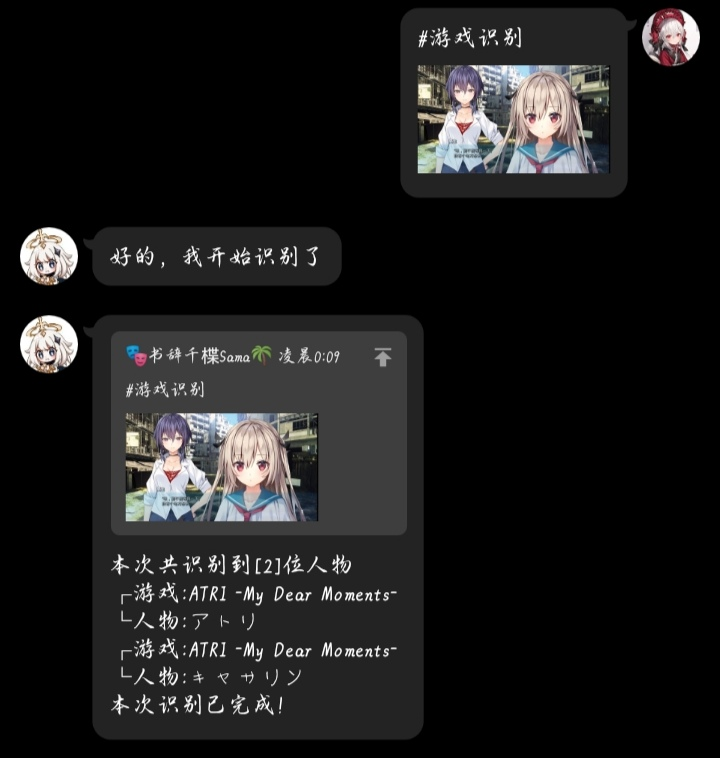
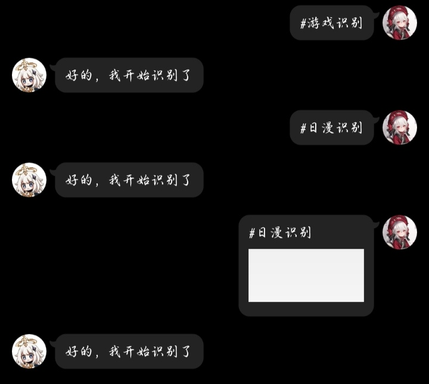

# 云崽日漫人物识别

## 简介
云崽(Yunzai-Bot)的日漫人物识别插件,提供简单的日漫(动漫)的人物识别和galgame游戏角色识别。
<br>


如果您在使用过程中有更好的建议，或者是功能反馈可添加以下群聊(也支持热聊哦~)
```
1061385377
```

## 食用方法
### #日漫识别



### #游戏识别



## 当前问题


此问题由于开发者懒所导致的
<br>
1.没有与指令一起发送图片，将不会回复
<br>
2.所发送的图片并没有识别到人脸，将不会回复
<br>
3.以上问题开发者将在以后版本进行修复

## 注意事项
1.本识别并不是万能的，可能会识别错误
<br>
2.提供的识别图片尽量提供人物正脸
<br>
3.galgame识别暂不支持R18内容识别

## 安装教程

### 第一步
本插件需要axios的支持，如果您已安装axios可跳过本步骤，如果您未安装，请执行一下指令安装axios。
<br>
pnpm可能会掉依赖，希望你不要中奖
``` 
pnpm add axios -w
```
npm可能连不上
```
npm install axios 
```
cnpm需要提前安装(指令已经在下面了可以直接复制一键执行)
```
pnpm install -g cnpm -registry=https://registry.npm.taobao.org
cnpm install axios
```
### 第二步

```
下载压缩包解压将js放到Yunzai-Bot\plugins\example重启即可
```

## 特别鸣谢
1.[AnimeTrace](https://ai.animedb.cn/)网站提供的人物识别功能
<br>
2.[@地球生物](https://gitee.com/jiang-zhitao-1)提供的开发